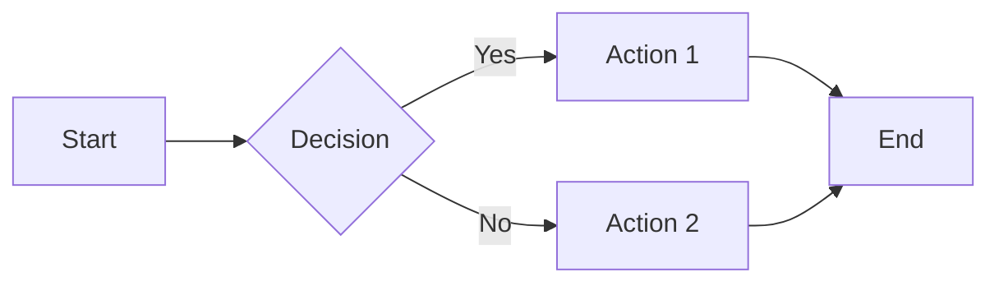
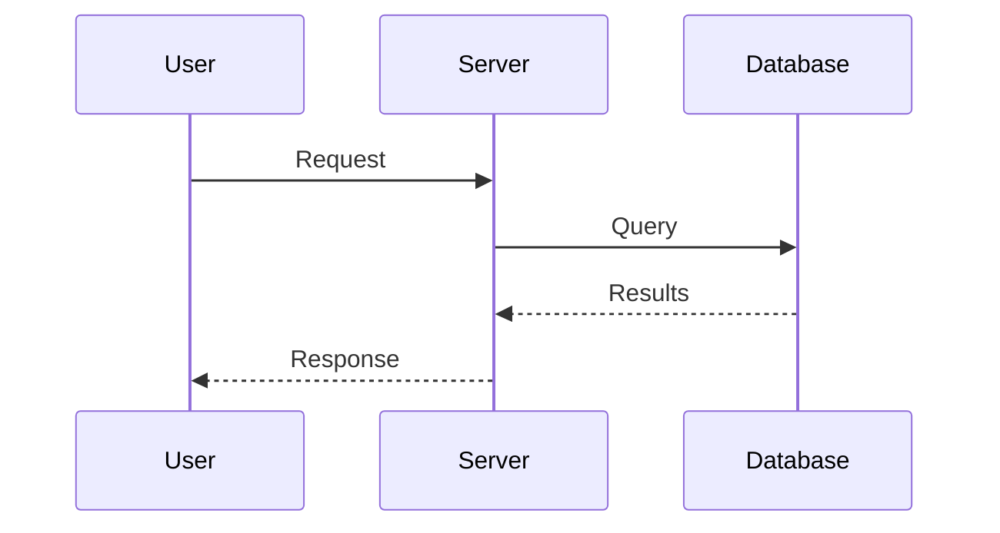

# Mintlify Master Reference Guide

A comprehensive reference for writing high-quality documentation with Mintlify. This guide covers all components, formatting rules, and best practices derived from official Mintlify documentation.

---

## Table of Contents

1. [MDX Fundamentals](#mdx-fundamentals)
2. [Page Frontmatter](#page-frontmatter)
3. [Text Formatting](#text-formatting)
4. [Code Blocks](#code-blocks)
5. [Callout Components](#callout-components)
6. [Step Components](#step-components)
7. [Accordion Components](#accordion-components)
8. [Card Components](#card-components)
9. [Tab Components](#tab-components)
10. [Frame Component](#frame-component)
11. [Icon Usage](#icon-usage)
12. [Tables](#tables)
13. [Lists](#lists)
14. [Links and Anchors](#links-and-anchors)
15. [Media and Embeds](#media-and-embeds)
16. [API Documentation Components](#api-documentation-components)
17. [Mermaid Diagrams](#mermaid-diagrams)
18. [Tooltips](#tooltips)
19. [Columns Layout](#columns-layout)
20. [Reusable Snippets](#reusable-snippets)
21. [Update/Changelog Component](#updatechangelog-component)
22. [Navigation Configuration](#navigation-configuration)
23. [Global Settings (docs.json)](#global-settings-docsjson)
24. [SEO and Metadata](#seo-and-metadata)
25. [Hidden Pages](#hidden-pages)
26. [Redirects](#redirects)
27. [Common Mistakes and Troubleshooting](#common-mistakes-and-troubleshooting)
28. [Writing Best Practices](#writing-best-practices)

---

## MDX Fundamentals

MDX combines Markdown with embedded React components. This means you can use standard Markdown syntax alongside custom components.

### Key Rules

1. **Blank lines are critical** - Always add blank lines before AND after component tags
2. **Use 2-space indentation** within components
3. **Use `.mdx` extension** for pages (`.md` won't render components)
4. **Drop the extension** when referencing pages in navigation or links

### Example Structure

```mdx
---
title: "Page Title"
description: "Page description"
---

## First Section

Regular markdown content here.

<Note>

This is a note component with proper blank lines.

</Note>

More content continues here.
```

---

## Page Frontmatter

Every page begins with YAML frontmatter enclosed by triple dashes.

### Required Properties

| Property | Type | Description |
|----------|------|-------------|
| `title` | string | Page title (displays at top and in sidebar) |
| `description` | string | Short summary for SEO and page subtitle |

### Optional Properties

| Property | Type | Description |
|----------|------|-------------|
| `sidebarTitle` | string | Shorter title for navigation (if main title is long) |
| `icon` | string | Font Awesome icon name for sidebar |
| `iconType` | string | Icon style: `regular`, `solid`, `light`, `thin`, `sharp-solid`, `duotone`, `brands` |
| `"og:image"` | string | Social sharing image URL |
| `"og:title"` | string | Social sharing title |
| `keywords` | array | SEO keywords (YAML array format) |

### Complete Example

```yaml
---
title: "Set Up Your First Scheduler"
description: "Create and configure a booking scheduler in under 5 minutes"
sidebarTitle: "First Scheduler"
icon: "calendar-plus"
iconType: "solid"
keywords: ["scheduler", "booking", "appointments"]
---
```

### Important Notes

- Meta tags with colons (like `og:image`) must be wrapped in quotes
- Keywords must be formatted as a YAML array: `["keyword1", "keyword2"]`
- If `title` is omitted, the filename becomes the title

---

## Text Formatting

### Basic Markdown Formatting

| Syntax | Result |
|--------|--------|
| `**bold**` | **bold** |
| `_italic_` or `*italic*` | *italic* |
| `**_bold and italic_**` | ***bold and italic*** |
| `~~strikethrough~~` | ~~strikethrough~~ |
| `` `inline code` `` | `inline code` |

### Superscript and Subscript

Use HTML tags (Markdown doesn't support these natively):

```html
H<sub>2</sub>O → H₂O
E=mc<sup>2</sup> → E=mc²
```

### Blockquotes

```markdown
> This is a single-line blockquote.

> This is a multi-line blockquote.
> Add `>` at the beginning of each line.
```

### Headers

- Use `##` (H2) as your top-level heading within content
- Never use `#` (H1) - the page title serves as H1
- Use `###` (H3) for subsections
- Each heading creates an anchor and appears in the table of contents

```markdown
## Main Section

Content here.

### Subsection

More content.
```

**Auto-generated anchors**: `### Hello World` creates anchor `#hello-world`

---

## Code Blocks

### Basic Syntax Highlighting

Specify the language after the opening backticks:

````markdown
```javascript
const greeting = "Hello World";
console.log(greeting);
```
````

Mintlify uses Shiki for syntax highlighting and supports all major languages.

### Named Code Blocks

Add a filename after the language:

````markdown
```javascript app.js
const express = require('express');
const app = express();
```
````

### Line Numbers

Use the `lines` property:

````markdown
```javascript lines
const a = 1;
const b = 2;
const c = 3;
```
````

### Line Highlighting

Highlight specific lines with `highlight`:

````markdown
```javascript highlight={1,3-5}
const a = 1;  // highlighted
const b = 2;
const c = 3;  // highlighted
const d = 4;  // highlighted
const e = 5;  // highlighted
```
````

### Line Focus

Focus on specific lines (dims others):

````markdown
```javascript focus={2-3}
const a = 1;
const b = 2;  // focused
const c = 3;  // focused
const d = 4;
```
````

### Expandable Code Blocks

For long code blocks:

````markdown
```javascript expandable
// Long code that can be collapsed
const config = {
  // ... many lines
};
```
````

### Code Diffs

Mark added and removed lines with special comments:

```javascript
const oldValue = "old"; // [!code --]
const newValue = "new"; // [!code ++]
```

### CodeGroup Component

Combine multiple code blocks with tabs:

```mdx
<CodeGroup>

```javascript app.js
console.log("JavaScript");
```

```python app.py
print("Python")
```

```bash Terminal
echo "Bash"
```

</CodeGroup>
```

**Important**: Every code block in a CodeGroup must have a filename - used as tab labels.

---

## Callout Components

Callouts add visual emphasis to important information. There are five types:

### Note

For additional context or information:

```mdx
<Note>

This provides additional context that's helpful but not critical.

</Note>
```

### Info

For general informational content:

```mdx
<Info>

**Where to find this**: Dashboard → Settings → Integrations

</Info>
```

### Tip

For best practices and helpful suggestions:

```mdx
<Tip>

**Pro tip**: You can use keyboard shortcuts to speed up this process.

</Tip>
```

### Warning

For critical warnings and cautions:

```mdx
<Warning>

This action cannot be undone. Make sure you have a backup before proceeding.

</Warning>
```

### Check

For success confirmations:

```mdx
<Check>

**Success!** Your changes have been saved.

</Check>
```

### Critical Formatting Rule

**Always include blank lines** after opening and before closing tags:

```mdx
✅ CORRECT:
<Warning>

Your warning message here.

</Warning>

❌ INCORRECT:
<Warning>
Your warning message here.
</Warning>
```

---

## Step Components

Steps are perfect for sequential procedures and tutorials.

### Basic Steps

```mdx
<Steps>

<Step title="First Step">

Description of the first step.

</Step>

<Step title="Second Step">

Description of the second step.

</Step>

<Step title="Third Step">

Description of the third step.

</Step>

</Steps>
```

### Step Properties

| Property | Type | Description |
|----------|------|-------------|
| `title` | string | **Required**. The primary text shown next to the step indicator |
| `icon` | string | Optional Font Awesome icon |
| `iconType` | string | Icon style (same options as page icons) |

### Customizing Step Title Size

You can customize the heading size:

```mdx
<Steps titleSize="h2">
  <!-- Steps with larger titles -->
</Steps>
```

Options: `p` (paragraph), `h2`, `h3`

### Nesting Components in Steps

You can nest other components inside steps:

```mdx
<Steps>

<Step title="Configure Settings">

Navigate to **Settings** and update your preferences.

<Tip>

Enable notifications to stay updated.

</Tip>

</Step>

<Step title="Verify Configuration">

Check that everything is working correctly.

<Check>

**Done!** Your settings are now active.

</Check>

</Step>

</Steps>
```

---

## Accordion Components

Accordions are collapsible sections for optional or supplementary content.

### Single Accordion

```mdx
<Accordion title="What if I forgot my password?">

Click the "Forgot Password" link on the login page and follow the instructions sent to your email.

</Accordion>
```

### Accordion Properties

| Property | Type | Description |
|----------|------|-------------|
| `title` | string | **Required**. The clickable header text |
| `icon` | string | Optional Font Awesome icon |
| `defaultOpen` | boolean | Whether expanded by default |

### AccordionGroup

Group multiple accordions together:

```mdx
<AccordionGroup>

<Accordion title="How do I reset my password?">

Go to Settings → Security → Reset Password.

</Accordion>

<Accordion title="Can I change my username?">

Usernames cannot be changed after account creation.

</Accordion>

<Accordion title="How do I delete my account?">

Contact support at help@example.com to request account deletion.

</Accordion>

</AccordionGroup>
```

---

## Card Components

Cards highlight main points, features, or navigation links.

### Single Card

```mdx
<Card title="Getting Started" icon="rocket" href="/quickstart">

Learn how to set up your account and create your first project.

</Card>
```

### Card Properties

| Property | Type | Description |
|----------|------|-------------|
| `title` | string | **Required**. Card heading |
| `icon` | string | Font Awesome icon, Lucide icon, or custom SVG |
| `href` | string | Link destination |
| `img` | string | Image URL to display |
| `horizontal` | boolean | Horizontal layout (image beside text) |

### CardGroup

Group multiple cards in a grid:

```mdx
<CardGroup cols={2}>

<Card title="Website Builder" icon="globe" href="/website">
  Create and customize your website
</Card>

<Card title="Scheduling" icon="calendar" href="/scheduling">
  Manage your calendar and bookings
</Card>

<Card title="Payments" icon="credit-card" href="/payments">
  Process payments and manage subscriptions
</Card>

<Card title="Inbox" icon="inbox" href="/inbox">
  Communicate with your clients
</Card>

</CardGroup>
```

### CardGroup Properties

| Property | Type | Description |
|----------|------|-------------|
| `cols` | number | Number of columns (1-4). Default: 2 |

---

## Tab Components

Tabs organize content into switchable panels.

### Basic Tabs

```mdx
<Tabs>

<Tab title="iOS">

Download from the App Store and sign in with your account.

</Tab>

<Tab title="Android">

Download from Google Play and sign in with your account.

</Tab>

<Tab title="Web">

Visit app.example.com and sign in with your account.

</Tab>

</Tabs>
```

### Tab Properties

| Property | Type | Description |
|----------|------|-------------|
| `title` | string | **Required**. Tab label |
| `icon` | string | Optional icon next to title |

### Nesting Components in Tabs

```mdx
<Tabs>

<Tab title="Quick Setup">

<Steps>

<Step title="Download the app">
Get it from your device's app store.
</Step>

<Step title="Sign in">
Use your existing credentials.
</Step>

</Steps>

</Tab>

<Tab title="Manual Setup">

For advanced users who need custom configuration.

<Warning>

Only recommended for experienced users.

</Warning>

</Tab>

</Tabs>
```

---

## Frame Component

Frames add styled borders and visual emphasis to images and other content.

### Basic Image Frame

```mdx
<Frame>


</Frame>
```

### Frame with Caption

```mdx
<Frame caption="The main dashboard showing your key metrics">


</Frame>
```

### Frame Properties

| Property | Type | Description |
|----------|------|-------------|
| `caption` | string | Caption text below the content |
| `type` | string | Frame style type |

---

## Icon Usage

Mintlify supports icons from Font Awesome, Lucide, custom SVGs, URLs, and local files.

### Font Awesome Icons

```yaml
# In frontmatter
icon: "calendar"
iconType: "solid"
```

```mdx
<!-- In content -->
<Icon icon="check" iconType="solid" />
```

### Icon Type Options

| Type | Description |
|------|-------------|
| `regular` | Default outline style |
| `solid` | Filled style |
| `light` | Thinner outline |
| `thin` | Thinnest outline |
| `sharp-solid` | Sharp corners, filled |
| `duotone` | Two-tone style |
| `brands` | Brand logos (e.g., GitHub, Twitter) |

### Custom SVG Icons

1. Convert your SVG using an SVGR converter
2. Wrap the JSX-compatible SVG in curly braces:

```mdx
<Card
  title="Custom Icon"
  icon={<svg width="24" height="24" viewBox="0 0 24 24"><path d="..."/></svg>}
>
  Card content here.
</Card>
```

### Icon Component

Display standalone icons:

```mdx
<Icon icon="check" color="#00ff00" size={24} />
```

---

## Tables

Use standard Markdown table syntax:

```markdown
| Header 1 | Header 2 | Header 3 |
|----------|----------|----------|
| Cell 1   | Cell 2   | Cell 3   |
| Cell 4   | Cell 5   | Cell 6   |
```

### Text Alignment

Use colons in the separator row:

```markdown
| Left | Center | Right |
|:-----|:------:|------:|
| L    | C      | R     |
```

---

## Lists

### Unordered Lists

```markdown
- First item
- Second item
  - Nested item
  - Another nested item
- Third item
```

### Ordered Lists

```markdown
1. First step
2. Second step
   1. Nested step
   2. Another nested step
3. Third step
```

### Lists in Components

When using lists inside components, ensure proper spacing:

```mdx
<Info>

**Prerequisites:**

- Item one
- Item two
- Item three

</Info>
```

---

## Links and Anchors

### Internal Links

Links to pages in your docs must be root-relative:

```markdown
[Link to Settings](/settings/general)
[Link to API Reference](/api-reference/overview)
```

**Note**: Drop the `.mdx` extension in links.

### External Links

```markdown
[Visit Google](https://google.com)
```

### Anchor Links (Same Page)

```markdown
[Jump to Installation](#installation)
```

### Anchor Links (Different Page)

```markdown
[Settings Authentication](/settings/general#authentication)
```

### Auto-Generated Anchors

Headings automatically generate anchors:

- `## Hello World` → `#hello-world`
- `### Quick Start Guide` → `#quick-start-guide`

---

## Media and Embeds

### Images

**Basic syntax:**

```markdown

```

**With Frame:**

```mdx
<Frame>


</Frame>
```

### Image Guidelines

- Store images in `/images/` directory
- Keep files under 5MB (host larger files externally)
- Use descriptive alt text for accessibility
- Supported formats: PNG, JPG, WebP, AVIF, GIF

### Embedding Videos

**YouTube:**

```html
<iframe
  className="w-full aspect-video rounded-xl"
  src="https://www.youtube.com/embed/VIDEO_ID"
  title="Video title"
  allow="accelerometer; autoplay; clipboard-write; encrypted-media; gyroscope; picture-in-picture"
  allowFullScreen
></iframe>
```

**Self-hosted video:**

```html
<video
  autoPlay
  loop
  muted
  playsInline
  src="/videos/demo.mp4"
>
  Your browser does not support video.
</video>
```

**Loom:**

Copy the embed code from Loom's share settings and paste directly.

### General iFrames

```html
<iframe src="https://example.com/embed" width="100%" height="400"></iframe>
```

---

## API Documentation Components

### ParamField

Define API parameters:

```mdx
<ParamField path="user_id" type="string" required>
  The unique identifier for the user.
</ParamField>

<ParamField query="limit" type="number" default="10">
  Maximum number of results to return.
</ParamField>

<ParamField body="email" type="string" required>
  User's email address.
</ParamField>

<ParamField header="Authorization" type="string" required>
  Bearer token for authentication.
</ParamField>
```

### ParamField Properties

| Property | Type | Description |
|----------|------|-------------|
| `path` | string | Path parameter name |
| `query` | string | Query parameter name |
| `body` | string | Body parameter name |
| `header` | string | Header parameter name |
| `type` | string | Data type (string, number, boolean, object, array) |
| `required` | boolean | Whether parameter is required |
| `default` | string | Default value |
| `deprecated` | boolean | Mark as deprecated |
| `placeholder` | string | Placeholder text in playground |

### ResponseField

Define API response fields:

```mdx
<ResponseField name="id" type="string">
  Unique identifier for the resource.
</ResponseField>

<ResponseField name="created_at" type="string">
  ISO 8601 timestamp of creation.
</ResponseField>
```

### ResponseField Properties

| Property | Type | Description |
|----------|------|-------------|
| `name` | string | **Required**. Field name |
| `type` | string | **Required**. Data type |
| `required` | boolean | Whether field is always present |
| `default` | string | Default value |

### Expandable

Show/hide nested fields:

```mdx
<ResponseField name="user" type="object">
  User information.

  <Expandable title="properties">

    <ResponseField name="name" type="string">
      User's full name.
    </ResponseField>

    <ResponseField name="email" type="string">
      User's email address.
    </ResponseField>

  </Expandable>

</ResponseField>
```

### Expandable Properties

| Property | Type | Description |
|----------|------|-------------|
| `title` | string | **Required**. Shown as "Show/Hide {title}" |
| `defaultOpen` | boolean | Whether expanded by default |

---

## Mermaid Diagrams

Create visual diagrams using Mermaid syntax:

### Flowchart

````markdown

````

### Sequence Diagram

````markdown

````

### Supported Diagram Types

- Flowchart
- Sequence diagram
- Class diagram
- State diagram
- Entity relationship diagram
- User journey
- Gantt chart
- Pie chart

### Interactive Controls

All Mermaid diagrams include zoom, pan, and reset controls in the bottom-right corner.

---

## Tooltips

Provide definitions or additional context on hover:

```mdx
The <Tooltip tip="Application Programming Interface">API</Tooltip> allows you to integrate with external services.
```

### With Call-to-Action

```mdx
Learn about our <Tooltip tip="Webhooks send real-time notifications when events occur." cta="Learn more" href="/webhooks">webhook system</Tooltip>.
```

### Tooltip Properties

| Property | Type | Description |
|----------|------|-------------|
| `tip` | string | **Required**. Tooltip text |
| `cta` | string | Call-to-action link text |
| `href` | string | URL for the CTA |

---

## Columns Layout

Create multi-column layouts:

```mdx
<Columns cols={2}>

<Card title="Feature 1">
  Description of feature 1.
</Card>

<Card title="Feature 2">
  Description of feature 2.
</Card>

</Columns>
```

Columns are responsive and automatically adjust for smaller screens.

---

## Reusable Snippets

### Creating Snippets

1. Create files in the `/snippets/` directory
2. Files in `/snippets/` won't render as standalone pages

**snippets/prerequisites.mdx:**

```mdx
<Info>

**Prerequisites:**

- Active CoachIQ account
- Admin permissions
- Completed onboarding

</Info>
```

### Using Snippets

Import and use in any page:

```mdx
import Prerequisites from '/snippets/prerequisites.mdx';

## Getting Started

<Prerequisites />

Now follow these steps...
```

### Variables in Snippets

**snippets/greeting.mdx:**

```mdx
export const Greeting = ({ name, product }) => (
  <p>Welcome to {product}, {name}!</p>
);
```

**Usage:**

```mdx
import { Greeting } from '/snippets/greeting.mdx';

<Greeting name="Coach" product="CoachIQ" />
```

### Important Notes

- Use arrow function syntax (`=>`) for JSX components
- The `function` keyword is not supported
- Relative imports are now supported (e.g., `../snippets/example.mdx`)

---

## Update/Changelog Component

Display version updates and release notes:

```mdx
<Update label="v2.0.0" date="January 15, 2025" tags={["feature", "improvement"]}>

## New Dashboard

Completely redesigned dashboard with improved metrics.

## Performance Improvements

- 50% faster page loads
- Reduced memory usage

</Update>
```

### Update Properties

| Property | Type | Description |
|----------|------|-------------|
| `label` | string | Version number or update name |
| `date` | string | Release date |
| `tags` | array | Filter tags (shown in sidebar) |
| `rss` | object | Custom RSS feed entry |

### Multiple Updates

```mdx
<Update label="v2.1.0" date="January 20, 2025">

Bug fixes and improvements.

</Update>

<Update label="v2.0.0" date="January 15, 2025">

Major release with new features.

</Update>
```

### RSS Feed

Update components automatically generate RSS feed entries. Use the `rss` prop for custom content:

```mdx
<Update
  label="v2.0"
  rss={{ title: "Version 2.0 Released", description: "Major update with new features." }}
>
  <!-- Content with components that won't appear in RSS -->
</Update>
```

---

## Navigation Configuration

### Basic Structure (docs.json)

```json
{
  "navigation": {
    "pages": [
      "introduction",
      "quickstart",
      "features/overview"
    ]
  }
}
```

### With Groups

```json
{
  "navigation": {
    "groups": [
      {
        "group": "Getting Started",
        "pages": ["introduction", "quickstart"]
      },
      {
        "group": "Features",
        "pages": ["features/overview", "features/advanced"]
      }
    ]
  }
}
```

### Nested Groups

```json
{
  "navigation": {
    "groups": [
      {
        "group": "Documentation",
        "pages": [
          "overview",
          {
            "group": "Writing",
            "icon": "pen",
            "pages": ["writing/basics", "writing/advanced"]
          }
        ]
      }
    ]
  }
}
```

### With Tabs

```json
{
  "navigation": {
    "tabs": [
      {
        "tab": "Documentation",
        "groups": [
          {
            "group": "Getting Started",
            "pages": ["intro", "quickstart"]
          }
        ]
      },
      {
        "tab": "API Reference",
        "groups": [
          {
            "group": "Endpoints",
            "pages": ["api/users", "api/products"]
          }
        ]
      }
    ]
  }
}
```

### Group Properties

| Property | Type | Description |
|----------|------|-------------|
| `group` | string | Group name in sidebar |
| `pages` | array | Page paths or nested groups |
| `icon` | string | Icon for the group |
| `hidden` | boolean | Hide entire group |

### Important Notes

- Don't include `.mdx` in page paths
- Paths must match actual file structure
- Don't name top-level folders `api` (reserved by Next.js)

---

## Global Settings (docs.json)

### Minimal Required Configuration

```json
{
  "$schema": "https://mintlify.com/docs.json",
  "theme": "mint",
  "name": "Your Docs",
  "colors": {
    "primary": "#F9C117"
  },
  "navigation": {
    "pages": ["introduction"]
  }
}
```

### Available Themes

| Theme | Description |
|-------|-------------|
| `mint` | Default green theme |
| `maple` | Warm autumn colors |
| `palm` | Tropical feel |
| `willow` | Soft natural tones |
| `linden` | Light and airy |
| `almond` | Neutral and warm |

### Color Configuration

```json
{
  "colors": {
    "primary": "#F9C117",
    "light": "#FDDC7B",
    "dark": "#D4A017",
    "background": {
      "light": "#FFFFFF",
      "dark": "#0D0D0D"
    }
  }
}
```

### Font Configuration

```json
{
  "font": {
    "headings": "Playfair Display",
    "body": "Open Sans"
  }
}
```

Only Google Fonts are supported.

### Code Block Themes

```json
{
  "styling": {
    "codeblocks": "dark"
  }
}
```

Options: `"system"`, `"dark"`, or custom Shiki themes.

---

## SEO and Metadata

### Automatic Meta Tags

Mintlify automatically generates:

- `charset: utf-8`
- `og:type: website`
- `og:site_name: [Your site name]`
- `twitter:card: summary_large_image`
- `twitter:image` (1200x630)

### Global Metadata (docs.json)

```json
{
  "metadata": {
    "og:image": "https://example.com/og-image.png",
    "twitter:site": "@yourhandle"
  }
}
```

### Page-Level Metadata

```yaml
---
title: "Your Page Title"
description: "SEO-optimized description under 155 characters"
"og:image": "/images/custom-og-image.png"
"og:title": "Custom Social Title"
keywords: ["keyword1", "keyword2", "keyword3"]
---
```

### Testing Social Sharing

- Facebook: Use [Sharing Debugger](https://developers.facebook.com/tools/debug/)
- Twitter/X: Use [Card Validator](https://cards-dev.twitter.com/validator)

---

## Hidden Pages

Pages not in navigation are hidden but still accessible via direct URL.

### Hiding a Page

Simply don't include it in `docs.json` navigation.

### Hiding Groups

```json
{
  "group": "Internal Docs",
  "hidden": true,
  "pages": ["internal/guide", "internal/notes"]
}
```

### Hiding Tabs

```json
{
  "tab": "Beta Features",
  "hidden": true,
  "groups": [...]
}
```

### Search Indexing

By default, hidden pages are excluded from:
- Search engines
- Internal search
- AI assistant context

To include hidden pages in search:

```json
{
  "seo": {
    "indexHiddenPages": true
  }
}
```

### Use Cases

- Beta documentation
- Legacy content
- Internal tools
- Context for AI assistants

---

## Redirects

### Basic Redirect

```json
{
  "redirects": [
    {
      "source": "/old-page",
      "destination": "/new-page"
    }
  ]
}
```

### Wildcard Redirects

```json
{
  "redirects": [
    {
      "source": "/v1/:slug*",
      "destination": "/v2/:slug*"
    }
  ]
}
```

Example: `/v1/api/users` → `/v2/api/users`

### When to Use Redirects

- Renaming pages
- Restructuring navigation
- Deprecating old URLs
- Preserving SEO for moved content

---

## Common Mistakes and Troubleshooting

### Component Not Rendering

**Problem**: Component appears as raw text

**Solutions**:
1. Add blank lines before AND after component tags
2. Ensure file has `.mdx` extension (not `.md`)
3. Check for proper closing tags
4. Verify proper nesting

```mdx
❌ WRONG:
<Note>
Content here
</Note>

✅ CORRECT:
<Note>

Content here

</Note>
```

### Navigation Not Showing

**Problem**: Page exists but doesn't appear in navigation

**Solutions**:
1. Ensure path in `docs.json` matches file path exactly
2. Don't include `.mdx` extension in navigation
3. Check for typos in path

### Images Not Loading

**Problem**: Images show as broken

**Solutions**:
1. Use absolute paths starting with `/`
2. Ensure file exists in `/images/` directory
3. Check file size (under 5MB)
4. Verify file extension matches actual format

### Links Not Working

**Problem**: Internal links return 404

**Solutions**:
1. Use root-relative paths (start with `/`)
2. Don't include `.mdx` extension
3. Match exact file path structure

### Code Blocks Not Highlighting

**Problem**: Code appears without syntax highlighting

**Solutions**:
1. Specify language after opening backticks
2. Use supported language name
3. Check for proper backtick characters

### API Playground Not Appearing

**Problem**: API page doesn't show playground

**Solutions**:
1. Verify OpenAPI spec is valid (use Swagger Editor)
2. Ensure OpenAPI 3.0+ (not 2.0)
3. Check server URL is specified
4. Verify `api` or `openapi` frontmatter is set

---

## Writing Best Practices

### Audience Focus

- Know your primary audience
- Don't try to serve everyone
- Write for their skill level
- Use appropriate terminology

### Content Organization (Diátaxis Framework)

| Type | Purpose | Structure |
|------|---------|-----------|
| **Tutorials** | Learning-oriented | Step-by-step, hands-on |
| **How-to Guides** | Task-oriented | Procedural, goal-focused |
| **Reference** | Information-oriented | Accurate, complete |
| **Explanation** | Understanding-oriented | Conceptual, contextual |

### Writing Style

- Use second person ("you")
- Use active voice
- Write in present tense
- Be direct and concise
- Avoid exclamation points
- Lead with the most important information

### Content Guidelines

- **Be tactical**: Focus on "how to do X"
- **Set clear goals**: What will the reader accomplish?
- **Use components**: Make content scannable
- **Limit media**: Screenshots become outdated quickly
- **Ensure accessibility**: Alt text, clear headings

### Maintenance

- Assign documentation ownership
- Regular link audits
- Update screenshots selectively
- Review for accuracy periodically

---

## Quick Reference Card

### Essential Components

| Component | Use For |
|-----------|---------|
| `<Steps>` | Sequential procedures |
| `<Tabs>` | Platform/option variations |
| `<Note>` | Additional context |
| `<Tip>` | Best practices |
| `<Warning>` | Critical cautions |
| `<Check>` | Success confirmation |
| `<Info>` | General information |
| `<Accordion>` | Optional/FAQ content |
| `<Card>` | Feature highlights, navigation |
| `<CardGroup>` | Grid of cards |
| `<Frame>` | Image wrapper |
| `<CodeGroup>` | Multi-language code |

### Frontmatter Template

```yaml
---
title: "Clear Action-Focused Title"
description: "Value proposition in under 155 characters"
sidebarTitle: "Short Title"
icon: "icon-name"
---
```

### Formatting Checklist

- [ ] Blank lines around all components
- [ ] 2-space indentation in components
- [ ] Root-relative links (no `.mdx`)
- [ ] Alt text for all images
- [ ] H2 (`##`) as top heading level
- [ ] Code language specified

---

## Resources

- [Mintlify Official Docs](https://mintlify.com/docs)
- [Mintlify Guides](https://mintlify.com/guides)
- [Font Awesome Icons](https://fontawesome.com/icons)
- [Mermaid Documentation](https://mermaid.js.org/)
- [Shiki Languages](https://shiki.style/languages)

---

*This reference compiled from official Mintlify documentation and best practices. Last updated: January 2025.*
